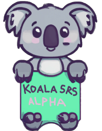

# KoalaCards

  

  

  
  

  <a href="https://youtu.be/OWjfC7ia1c8">
    Demo video (June 2025)
     
    
  </a>

## Status

KoalaCards is complete! It meets my daily learning needs and is now in maintenance mode. The project accepts bug fixes and security updates only; no new features are planned.

## Overview

KoalaCards is a spaced repetition system for English speakers learning Korean. It emphasizes speaking and writing practice with automatic grading and feedback powered by OpenAI models.

The app focuses exclusively on Korean to allow for the best prompts possible.

## Current feature set

- Review sessions with new, remedial, and routine cards scheduled by FSRS (via `femto-fsrs`).
- Speaking quizzes that record audio, transcribe responses, and grade answers using an LLM. Grading results are stored for later review.
- Writing practice with user-defined prompts, AI corrections, and diff views. Daily writing goals are trackable.
- Study assistant chat that references recent cards and can suggest or create new cards.
- Card creation workflows: free-form generation, word list enrichment, CSV parsing.
- Deck and card management: edit, pause, merge, publish, copy, import/export.
- Optional AI-generated images for cards.

## Architecture and stack

- Next.js (pages router) with React and TypeScript
- tRPC for API procedures
- Prisma with PostgreSQL
- Mantine for UI
- NextAuth for email magic links or Google OAuth

## External services

KoalaCards depends on hosted services in production:

- OpenAI API for LLM grading, study assistant chat, card parsing/generation, speech-to-text, and definition text-to-speech.
- Google Cloud Text-to-Speech for term audio and Google Cloud Storage for cached audio and images.
- Email delivery (for magic links) or Google OAuth for authentication.

Setup details live in `SETUP.md` and `example.env`.

## Documentation

- `SETUP.md` for environment setup and infrastructure requirements.
- `USER_MANUAL.md` for end-user workflows and route-level behavior.

## Contributing

Maintenance mode applies. Please focus contributions on bug fixes, security updates, or documentation corrections. For feature requests, open an issue to discuss scope.

## License

MIT. See `LICENSE`.
