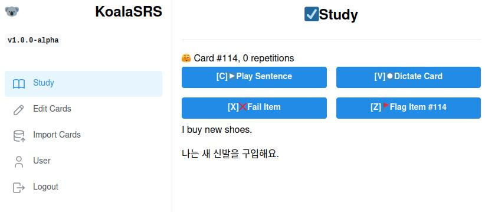

# KoalaSRS 🐨

  

Hey there! Welcome to KoalaSRS, a fun and friendly Korean-only [spaced repetition system](https://en.wikipedia.org/wiki/Spaced_repetition) that's all about listening and speaking skills. We teach vocabulary using fully-formed sentences, not just boring word/definition pairs. KoalaSRS captures your voice input using speech-to-text and uses the super-smart GPT-3 for human-like test assessments and corrections. That means that the app is clever enough to mark your answers as "close enough" and can even give you optional feedback about _why_ you were wrong (Called "coaching"- UI is not built yet but early experiments are promising). It can explain sentences that don't make sense or have unknown vocabulary. 🧠

## UNDER CONSTRUCTION ⚠️

The app started as a command line app while I experimented with different quiz strategies. Now that the details are resolved, I am converting the app to run in a browser so that it can be used by non-technical users. I am working directly off of the `main` branch for now since it seems like we don't have a ton of users. If you want to use the app but are hitting stability issues, please reach out.

## Table of Contents 📑

- [Demo](#Demo)
- [Features](#features)
- [Why Another SRS?](#why-another-srs)
- [Developer Setup](#developer-setup)
- [Contribution Guidelines](#contribution-guidelines)
- [Project Status and Limitations](#project-status-and-limitations)
- [Costs (April 2023)](#costs-april-2023)
- [Better Name Needed](#better-name-needed)

## Demo

[Watch a quick YouTube demo where I foolishly say "들고 싶어요" instead of "듣고 싶어요"](https://youtu.be/XJsDDZQp2oo)

  

## Features 💡

KoalaSRS rocks a minimal GUI because the focus is on what you can _hear_, not what you can see. 🎧

Here's how the app works:

1. Korean sentences with English translations are loaded into a SQLite database (I use `seeds.ts` for now but an editor is in the works).
1. The app creates a queue of sentences, sorted by difficulty. Difficulty comes from past quiz fails. More on quizzes soon.
1. The app asks the user to take one of three quizzes. All quizzes involve listening to Korean speech or speaking Korean sentences into the microphone. 🎤
1. The user has to pass a quiz to move on.
1. Once the quiz is complete, the sentence is played back in Korean and English. The user's audio is also played back to help with pronunciation.
1. The process goes on until the queue is empty or the user quits the program.

The app has three types of quizzes:

- **Dictation quiz:** You read a Korean phrase aloud, and the app transcribes it using speech-to-text technology. GPT-3 grades your answer. This quiz is the easiest one and focuses on pronunciation and memorization. 🗣️
- **Listening quiz:** You listen to a Korean phrase and then translate it to English. This quiz comes after the dictation phase. 🎶
- **Speaking quiz:** You get an English text and are asked to say it in Korean. The program transcribes your phrase via speech-to-text, and GPT-3 grades your answer. 📣

Please note that this app is not ready for non-technical users just yet. If you want to try the app, you'll need to clone this repo and build it on your local machine. There's no public demo available, but we'd love your feedback! 😊

The program also comes with helper functions for formatting prompts, grading responses, and inspecting results.

## Why Another SRS? 🤔

I studied Korean at university and did self-study for many years before that. I saw lots of flaws in existing solutions but couldn't build alternatives because software tools weren't ready yet. I've been dreaming about building this spaced repetition system for over a decade! Finally, in 2023, it's possible thanks to large language models (LLMs) like GPT and affordable, high-quality text-to-speech and speech-to-text APIs. 🎉

Check out the [whitepaper](https://github.com/RickCarlino/gpt-language-learning-experiments) I wrote that explains the main idea. I also wrote a [blog article back in 2019](https://rickcarlino.com/2019/problems-and-solutions-for-spaced-repetition-software.html) about some problems and solutions with SRS systems.

## Developer Setup 🛠️

**Prerequisites:** NodeJS is required. I've tested it on v18 of node, and newer versions will probably work too.

The project is in a semi-public alpha phase. If you don't understand the instructions below, you might want to wait for the project to mature before proceeding. Please only contact me for help if you're a professional software developer.

1. Install NodeJS if you have not done so already.
1. Clone this repo and `cd` in.
1. Create an [OpenAI API key](https://platform.openai.com/account/api-keys).
1. Create a [Google Cloud Service Account JSON credentials file](https://developers.google.com/workspace/guides/create-credentials)
1. Make sure the Google Cloud service account can access Cloud Speech API and Cloud Text-to-Speech APIs.
1. Copy `example.env` to `.env`.
1. Fill out the ENV vars to match your OpenAI / GCS credentials.
1. Run `npm reset`.
1. Run `npm start`.

## Contribution Guidelines 🤝

The source code is permissively licensed and open for review by software developers. The project is in a very early state and not ready for the general public. Got questions? Raise an issue! You can also reach me via DM on Reddit for general discussion (GitHub and Reddit usernames are the same).

## Project Status and Limitations ⚠️

- I use the app every day for studying, but the documentation is, well, not great. If you really want to use this app, consider DMing me on Reddit for help.
- By design, the app won't quiz on reading or writing. This is a speaking/listening app.
- The target user is English speakers trying to learn Korean. I can add other language pairs later, but the main focus right now is EN/KO.
- **The scheduling algorithm is on hold.** I had a simple heuristic-based scheduling algorithm, but the app currently just does a simple shuffle of all sentences at start time. This is adequate for my study needs right now and allows me to focus on other parts of the app's development. Getting a real scheduling algorithm (like SM-2) is planned.

## Costs (April 2023) 💰

The app uses Google Cloud and OpenAI APIs, and neither of these services is free. A 15 minute session on the app costs about $0.01 USD for GPT-3.5 access, while the cost of Speech-to-text/Text-to-speech for a much longer session is 1 cent USD / session. Because of caching mechanisms, text-to-speech becomes cheaper over time.

## Better Name Needed 📛

I picked this name in a snap because it starts with the letter "K" just like "Korean." Maybe we can think of something better?
