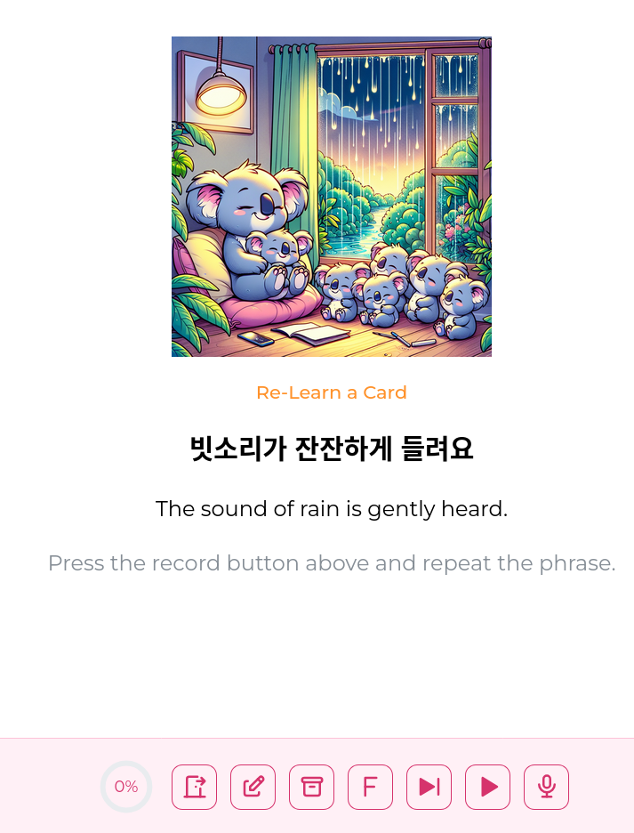

## WHERE DO I SIGN UP?

I host a demo instance of the app [here](https://app.koala.cards/user) but please keep in mind I may **turn off the server during peak usage** to reduce costs. I have set up a [Patreon](https://www.patreon.com/rickcarlino) to help offset hosting costs. Please consider donating if you find the app useful.

## Officially Supported Languages
Korean, French, Italian, Spanish,

## Supported, But Untested/Limited Support

Arabic, Catalan, Chinese, Czech, Danish, Dutch, English, Finnish, Galician, German, Greek, Gujarati, Hebrew, Hindi, Hungarian, Indonesian, Japanese, Kannada, Latvian, Lithuanian, Malay, Marathi, Norwegian, Polish, Portuguese, Punjabi, Romanian, Russian, Serbian, Slovak, Swedish, Thai, Turkish, Ukrainian, Vietnamese,

# KoalaCards 🐨

<p align="center">
  
</p>
<a href="https://codeclimate.com/github/RickCarlino/KoalaCards/maintainability"></a>

KoalaCards is a [spaced repetition system](https://en.wikipedia.org/wiki/Spaced_repetition) that focuses on listening and speaking skills. KoalaCards captures your voice input using speech-to-text and large language models for human-like test assessments. This has two advantages over traditional spaced repetition systems:

1. Results are recorded objectively via machine-assisted grading rather than self-grading.
2. "Close enough" answers that match the meaning of the target sentence and which demonstrate understanding will be accepted. This captures the flexibility of self-grading with the objectivity of external grading.

## Table of Contents 📑

- [Demo](#demo-video)
- [Features](#features-)
- [Another Spaced Repetition System?](#another-spaced-repetition-system)
- [Developer Setup](#developer-setup-%EF%B8%8F)
- [Contribution Guidelines](#contribution-guidelines-)
- [Project Status and Limitations](#project-status-and-limitations-%EF%B8%8F)
- [Help Needed](#help-needed-)

## Demo Video

<p align="center">
  <a href="https://www.youtube.com/watch?v=xu7NxSei11Q">
    Watch a short YouTube demo of the app as of August 2024
    <br/>
    
  </a>
</p>

## ~~ALPHA~~ Beta Software

The app is now stable enough to be used for serious studying. If you want to use the app but are hitting stability issues, please reach out.

## Features 💡

Here's how the app works:

1. You input target language (KO/ES/FR/IT) sentences with English translations into the app.
1. The app schedules a queue of sentences using the [FSRS scheduling algorithm](https://github.com/open-spaced-repetition/fsrs4anki).
1. The app asks the user to take a listening or speaking quiz. All quizzes involve listening to target language speech or speaking target language sentences into the microphone. 🎤
1. The user must pass a quiz to move on to the next card.
1. The process goes on until the queue is empty.

The app has two types of quizzes:

- **Listening quiz:** You listen to a target language phrase and then translate it to English. This quiz comes after the dictation phase. 🎶
- **Speaking quiz:** You get an English text and are asked to say it in the target language. The app transcribes your phrase via speech-to-text, and GPT-3 grades your answer. 📣

Other types of quizzes, such as listening comprehension, may be added in the future.

## Another Spaced Repetition System?

I studied Korean at university and did self-study for many years before that. I saw lots of flaws in existing solutions but couldn't build alternatives because software tools weren't ready yet. I've been dreaming about building this spaced repetition system for over a decade! Finally, in 2023, it became possible thanks to large language models (LLMs) like GPT and affordable, high-quality text-to-speech and speech-to-text APIs. 🎉

Check out the [whitepaper](https://github.com/RickCarlino/gpt-language-learning-experiments) I wrote that explains the main idea. I also wrote a [blog article back in 2019](https://rickcarlino.com/2019/problems-and-solutions-for-spaced-repetition-software.html) about some problems and solutions with SRS systems.

## Developer Setup 🛠️

See [SETUP.md](SETUP.md)

## Contribution Guidelines 🤝

The source code is permissively licensed and open for review by software developers. Got questions? Raise an issue! You can also reach me via DM on Reddit for general discussion (GitHub and Reddit usernames are the same).

## Project Status and Limitations ⚠️

- I use the app every day, multiple times per day for studying. It is stable, but the documentation is not great. If you want to use this app, consider DMing me on Reddit/LinkedIn for help.
- By design, the app won't quiz on reading or writing. This is a speaking/listening app and there are better ways to practice writing and reading.
- The target user is English speakers trying to learn Korean. I have added beta support for ES/FR/IT, but the main focus right now is EN/KO.

## Help Needed 📛

The project could use help in the following areas:

1. I'd like to create a large library of example sentences that are appropriate for use with the app. For this, I'd need the help of a Korean native speaker who can curate and moderate a large corpus of AI-generated phrases containing target grammar/vocab.
1. UI/UX needs an overall and has not been a priority due to time constraints. If you would like to improve the UI, please reach out.
1. If you have a background in linguistics or Korean language education, please reach out.
1. The app relies heavily on Google Cloud and OpenAI for text-to-speech and AI features. I would be interested in exploring other options, such as different TTS or LLM providers.

## CORS Setup on Google Cloud

```json
// VIEW: gcloud storage buckets describe gs://....
// EDIT: gcloud storage buckets update gs://.... --cors-file=foo.json
[
  {
    "origin": ["https://app.koala.cards"],
    "method": ["GET", "HEAD", "PUT", "POST"],
    "responseHeader": ["Content-Type"],
    "maxAgeSeconds": 3600
  }
]
```
